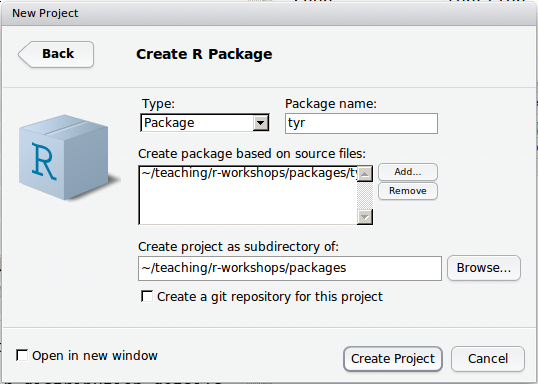
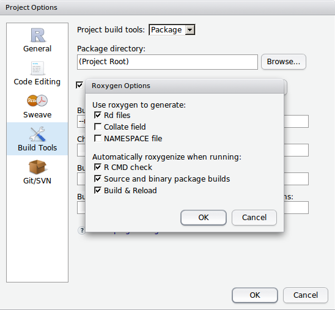

# Overview

- a format for easily sharing code with colleagues
- mostly users receiving code from experts
- less difficult than you'd think, making it a good option for
  intermediate R users as well 

# Motivation
- simple utility functions

```{r}
topCor <- function(dat, lim = 5, thresh = 0.9){
  cors <- cor(dat)
  res <- list()
  for (i in 1:nrow(cors)){
    tmp <- list(cors[i, order(abs(cors[i,]),
                              decreasing = TRUE)][1:(1 + lim)])
    if (tmp[[1]][2] > thresh){
      lab <- names(tmp[[1]])[1]
      res <- c( res, list(tmp[[1]][-1]))
      names(res)[length(res)] <- lab
    }
  }
  res  
}
```

# Motivation
```{r, message=FALSE}
library(vegan)
data(varechem)
topCor(varechem, thresh = 0.8)
```

# Options
- `source("/path/to/topCor.R")`
    + need to keep the file accessible
- add it to `.Rprofile`
    + loads automatically

- function lost with `rm(list=ls())`
- no documentation

# Package Benefits
- universally available on your system via `library()`
- safe from `rm(list=ls())`
- you can add documentation
- easy to share


# What is a Package?

A group of files in a directory

At least:
- a `DESCRIPTION` file
- an `R` directory with one or more `.R` code files

Should contain:
- a `man` directory with your documentation

Optional contents:
- `data` directory for data files
- `src` directory for source code from compiled languages (C, C++ etc.)
- `inst/doc` directory for longer documentation files: vignettes,
  tutorials etc.

# Getting Started

- Install the development tools: https://support.rstudio.com/hc/en-us/articles/200486498
- Install the `devtools` package: `install.packages("devtools")`
- Install the `roxygen2` package: `install.packages("roxygen2")`
- In RStudio `File` -> `New Project` -> `New Directory` -> `R Package`

# Getting Started


# DESCRIPTION

```
Package: tyr
Type: Package
Title: What the package does (short line)
Version: 1.0
Date: 2014-02-21
Author: Who wrote it
Maintainer: Who to complain to <yourfault@somewhere.net>
Description: More about what it does (maybe more than one line)
License: What license is it under?
```

# tyr/R/tyr

```{r, eval = FALSE}
topCor <- function(dat, lim = 5, thresh = 0.9){
  cors <- cor(dat)
  res <- list()
  for (i in 1:nrow(cors)){
    tmp <- list(cors[i, order(abs(cors[i,]), decreasing = TRUE)][1:(1 + lim)])
    if (tmp[[1]][2] > thresh){
      lab <- names(tmp[[1]])[1]
      res <- c( res, list(tmp[[1]][-1]))
      names(res)[length(res)] <- lab
    }
  }
  res
}

```

# tyr/man/

```
topCor.Rd
tyr-package.Rd
```

# tyr/man/tyr-package.Rd

```{latex}
\name{tyr-package}
\alias{tyr-package}
\alias{tyr}
\docType{package}
\title{
What the package does (short line)
~~ package title ~~
}
\description{
More about what it does (maybe more than one line)
~~ A concise (1-5 lines) description of the package ~~
}
\details{
\tabular{ll}{
Package:  tyr
Type:  Package
Version:  1.0
Date:  2014-02-21
License:  What license is it under?
}
~~ An overview of how to use the package, including ~~
~~ the most important functions ~~
}
```

# tyr/man/tyr-package.Rd

```{latex}
\author{
Who wrote it

Maintainer: Who to complain to <yourfault@somewhere.net>
~~ The author and/or maintainer of the package ~~
}
\references{
~~ Literature or other references for background information ~~
}
~~ Optionally other standard keywords, one per line, ~~
~~ from file KEYWORDS in the R documentation ~~
~~ directory ~~
\keyword{ package }
\seealso{
~~ Optional links to other man pages, e.g. ~~
~~ \code{\link[<pkg>:<pkg>-package]{<pkg>}} ~~
}
\examples{
~~ simple examples of the most important functions ~~
}
```

# tyr/man/topCor.Rd

```{latex}
\name{topCor}
\alias{topCor}
%- Also NEED an '\alias' for EACH other topic documented here.
\title{
%%  ~~function to do ... ~~
}
\description{
%%  ~~ A concise (1-5 lines) description of what the function does. ~~
}
\usage{
topCor(dat, lim = 5, thresh = 0.9)
}
%- maybe also 'usage' for other objects documented here.
\arguments{
  \item{dat}{
%%     ~~Describe \code{dat} here~~
}
  \item{lim}{
%%     ~~Describe \code{lim} here~~
}
  \item{thresh}{
%%     ~~Describe \code{thresh} here~~
}
}
```

# tyr/man/topCor.Rd

```{latex}
\details{
%%  ~~ If necessary, more details than the description above ~~
}
\value{
%%  ~Describe the value returned
%%  If it is a LIST, use
%%  \item{comp1 }{Description of 'comp1'}
%%  \item{comp2 }{Description of 'comp2'}
%% ...
}
\references{
%% ~put references to the literature/web site here ~
}
\author{
%%  ~~who you are~~
}
\note{
%%  ~~further notes~~
}

%% ~Make other sections like Warning with \section{Warning }{....} ~

\seealso{
%% ~~objects to See Also as \code{\link{help}}, ~~~
}
```

# tyr/man/topCor.Rd

```{latex}
\examples{
##---- Should be DIRECTLY executable !! ----
##-- ==>  Define data, use random,
##--	or do  help(data=index)  for the standard data sets.

## The function is currently defined as
function (dat, lim = 5, thresh = 0.9) 
{
    cors <- cor(dat)
    res <- list()
    for (i in 1:nrow(cors)) {
        tmp <- list(cors[i, order(abs(cors[i, ]), decreasing = TRUE)][1:(1 + 
            lim)])
        if (tmp[[1]][2] > thresh) {
            lab <- names(tmp[[1]])[1]
            res <- c(res, list(tmp[[1]][-1]))
            names(res)[length(res)] <- lab
        }
    }
    res
  }
}
% Add one or more standard keywords, see file 'KEYWORDS' in the
% R documentation directory.
\keyword{ ~kwd1 }
\keyword{ ~kwd2 }% __ONLY ONE__ keyword per line
```

# Roxygen


# Roxygenize

