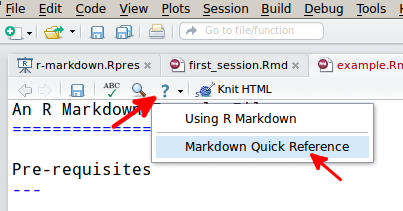
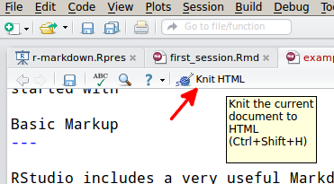
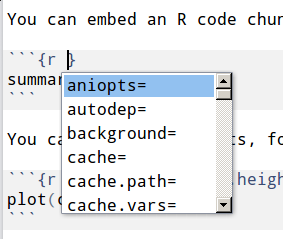

An R Markdown Example File
==========================

Pre-requisites
---

You should have:

* a __recent__ version of R installed
* the `knitr` package installed in R (`install.packages("knitr")` will do this)
* this file, and the `images` directory containing the three '.png' files used below. This file and the `images` directory must be together in the same directory
* [RStudio](http://www.rstudio.com) is not strictly necessary, but it's a very convenient program to get started with

Basic Markup
---

RStudio includes a very useful Markdown Quick Reference, which you can access from the *help* menu in the RStudio script editor window:



Clicking this link will open the reference in the RStudio help window. 

If you want more information, there is a lot of information about Markdown online, including tutorials and examples.

Generating HTML
---

Click the 'Knit HTML' button in the script editor window to convert your '.Rmd' file to an '.html' file.



This will save a new 'html' file in your working directory, and, if it's not already open, open a viewer to show you the result. Note that any images you include in your document are embedded in the 'html' file. That means you can send the single 'html' file to a colleague, and they'll be able to see everything there. If you want to share the source code with them, you'll need to send the '.Rmd' file. Note that an '.md' file is also produced, but you don't need to worry about this.


Embedding R
--

### Code

You can embed an R code chunk like this:

```{r}
summary(cars)
```

There are many options available for modifying the way R chunks are evaluated and inserted in your document. To see the options, with your cursor in the header for the chunk press the _tab_ key. A popup-window will display all the options for you:



You can scroll through these options with the **up** and __down__ arrows. Once you select an option, pressing _tab_ again will show you a list of the possible values for the option. The [knitr](http://yihui.name/knitr/) website includes a comprehensive explanation of all [chunk options](http://yihui.name/knitr/options).

You can also mix `R` code with your text, allowing you to reference data directly. For example, the value of pi is `r pi`, and 21 times 2 is `r 2 * 21`.

### Plots
You can also embed plots, for example:

```{r}
plot(Sepal.Length ~ Sepal.Width, 
     pch = as.numeric(Species),data = iris)
```

Chunk options can be used to modify the output. For example, setting the _echo_ argument to 'FALSE' will hide the R code and show only the figure:


```{r fig.height = 3.5, fig.width = 7.25, echo=FALSE}

par(mfrow = c(1, 2))
par(mar = c(3, 3, 0.5, 0.5))
mysymbols <- c(19, 5, 3)
plot(Sepal.Length ~ Sepal.Width, pch = mysymbols[as.numeric(Species)],
data = iris, ylim = c(3.5, 8), ann = FALSE, axes = FALSE)
box()
axis(side = 1, tcl = -0.2, mgp = c(3, 0.3, 0), cex.axis = 0.8)
axis(side = 2, tcl = -0.2, mgp = c(3, 0.3, 0), cex.axis = 0.8)
mtext("Sepal Width", side = 1, line = 1.5)
mtext("Sepal Length", side = 2, line = 1.5)
legend(legend = levels(iris$Species), x = "bottom", pch = mysymbols, horiz = TRUE,
bty = "n", cex = 0.9, text.width = c(0.6, 0.7, 0.6))
## For the first panel:
text("A", x = grconvertX(0.1, from = "npc", to = "user"), 
     y = grconvertY(0.9, from = "npc", to = "user"), cex = 2)

par(mar = c(3, 3, 0.5, 0.5))
boxplot(Petal.Width ~ Species, data = iris, axes = FALSE)
box()
axis(side = 1, at = 1:3, tcl = -0.2, mgp = c(3, 0.5, 0), 
     cex.axis = 1, labels = levels(iris$Species))
axis(side = 2, tcl = -0.2, mgp = c(3, 0.3, 0), cex.axis = 0.8)
mtext("Petal Width", side = 2, line = 1.5)

## For the first panel:
text("B", x = grconvertX(0.1, from = "npc", to = "user"), 
     y = grconvertY(0.9, from = "npc", to = "user"), cex = 2)
``` 

Generating PDF files
---

If you have [pandoc](http://johnmacfarlane.net/pandoc/)  and [LaTeX](http://www.latex-project.org/) installed, you can compile the `.Rmd` file to `.pdf` with the command:

```
pandoc example.md -o example.pdf
```

Note that this command runs from the command line, not from inside `R`. There are R tools to help with this. `knitr` provides the `pandoc()` function:

```{r, eval=FALSE}
library(knitr)
pandoc(input="example.md", format = "latex")
```

`pandoc` has many features and options --- check out the webpage for extensive documentation. 
